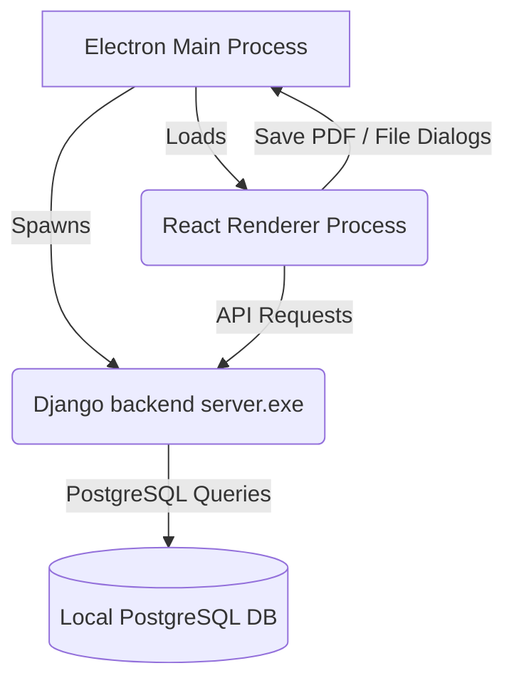

# GST Billing Desktop Application - Setup & Packaging Manual

This document details the desktop application architecture, prerequisites, environment setup, development workflows, and packaging procedures to build the final installer for the GST Billing Desktop Application.

---

## 1. Application Architecture

The application is structured as a standalone desktop app combining a high-performance Python/Django backend with a modern React/TypeScript/Electron frontend:



* **Frontend (`accounts_frontend`)**: Electron + Vite + React + TypeScript + Lucide icons. Operates on the client side, managing the desktop window framework, inter-process communication (IPC) for native Windows operations (such as save-dialogs, offscreen HTML-to-PDF rendering, and file launching), and UI rendering.
* **Backend (`accounts_backend`)**: Django + Django REST Framework + WeasyPrint. Handles database migrations, business logic, analytics, Excel generation, and PDF document generation. It compiles into a standalone `server.exe` using **PyInstaller**.
* **Database (PostgreSQL)**: The app runs queries against a local PostgreSQL server.

---

## 2. System Prerequisites

To build and run the application, ensure the following software is installed on the machine:

1. **Node.js** (v18.0.0 or higher recommended)
2. **Python** (v3.10.x - v3.12.x recommended)
3. **PostgreSQL** (v14 or higher recommended)

### Default PostgreSQL Configuration
The application backend expects a local PostgreSQL server to be running with the following default configuration:
* **Host**: `localhost`
* **Port**: `5432`
* **Username**: `postgres`
* **Password**: `admin`
* **Database Name**: `joganiaccounts` (The backend automatically checks for and creates this database on start if it doesn't exist)

> [!NOTE]
> You can override these defaults by creating a `.env` file containing environment variables (`DB_NAME`, `DB_USER`, `DB_PASSWORD`, `DB_HOST`, `DB_PORT`) in the directory where `server.exe` runs (or at `accounts_backend/.env` during development).

---

## 3. Development Setup

Follow these steps to configure your local development workspace.

### Step A: Backend Environment Setup
1. Open a PowerShell terminal and navigate to the project directory:
   ```powershell
   cd e:\accounts\BillingApp
   ```
2. Activate the pre-configured virtual environment:
   ```powershell
   .\venv\Scripts\activate
   ```
3. Install/verify Python dependencies:
   ```powershell
   pip install -r requirements.txt
   ```

### Step B: Frontend Environment Setup
1. Navigate to the frontend directory:
   ```powershell
   cd e:\accounts\BillingApp\accounts_frontend
   ```
2. Install the package dependencies:
   ```bash
   npm install
   ```

---

## 4. Running the App in Development Mode

For rapid development and console debugging, it is recommended to run the backend and frontend separately:

### 1. Start the Django Server (Terminal 1)
```powershell
cd e:\accounts\BillingApp\accounts_backend
..\venv\Scripts\activate
python manage.py runserver
```
* The backend will run at `http://127.0.0.1:8000/`.
* On startup, Django runs database migrations and updates your PostgreSQL instance.

### 2. Start the Electron Dev Window (Terminal 2)
```powershell
cd e:\accounts\BillingApp\accounts_frontend
npm run dev
```
* Electron launches in a hot-reloading window, automatically linking to `http://localhost:8000/api`.

---

## 5. Compiling and Packaging the Application

When you are ready to create a distributable desktop app, you must package both components:

### Automated Build (Recommended)
We provide a root-level script `build.bat` that compiles the Django server with PyInstaller, injects it into the Electron package directory, and compiles the final setup installer.

#### Rebuilding the Application (After Code Changes)
If you modify frontend or backend code and want to rebuild the app, you **do not need to uninstall the existing application** or manually delete build folders. You only need to run the build script again:

1. **Automatic Process Termination**: The build script starts by automatically terminating any running instances of `accounts-frontend.exe` and `server.exe` to prevent Windows file-locking errors. If you are running Django or Node dev servers in open terminal windows, please close or stop them manually first.
2. **Ensure PostgreSQL is active** (needed to build or run verification).
3. **Run the Build Script**: Double-click [build.bat](file:///e:/accounts/BillingApp/build.bat) in the root directory or execute it from terminal:
   ```powershell
   cd e:\accounts\BillingApp
   .\build.bat
   ```
4. **Locate the Installer**: Once completed, a standard installer file named **`accounts-frontend-1.0.0-setup.exe`** will be generated inside:
   * [accounts_frontend/dist/](file:///e:/accounts/BillingApp/accounts_frontend/dist/)
5. **Apply the Update**: Double-click the newly generated setup installer to install the updated app. The installer will automatically overwrite the existing installation on your computer without requiring you to uninstall it first.

---

### Manual Compilation Breakdown

If you wish to build the application components individually, follow this workflow:

#### Step 1: Compile the Django Backend to an Executable
Run PyInstaller inside the `accounts_backend` directory:
```powershell
cd e:\accounts\BillingApp\accounts_backend
..\venv\Scripts\activate
pyinstaller --onefile --noconsole `
  --add-data "accounts/templates;accounts/templates" `
  --add-data "accounts/static;accounts/static" `
  --hidden-import=django.db.backends.postgresql `
  --hidden-import=psycopg2 `
  --hidden-import=weasyprint `
  --hidden-import=openpyxl `
  --hidden-import=jwt `
  --hidden-import=dotenv `
  --collect-all accounts `
  --collect-all config `
  --collect-all rest_framework `
  --collect-all corsheaders `
  server.py
```
This generates `server.exe` inside [accounts_backend/dist/](file:///e:/accounts/BillingApp/accounts_backend/dist/).

#### Step 2: Build the Electron App & Windows Installer
Navigate to the frontend folder and run the builder:
```powershell
cd e:\accounts\BillingApp\accounts_frontend
npm run build:win
```
* This triggers `electron-vite build` to compile the React and Electron code.
* `electron-builder` reads [electron-builder.yml](file:///e:/accounts/BillingApp/accounts_frontend/electron-builder.yml), loads the compiled `server.exe` from `../accounts_backend/dist/server.exe`, embeds it inside the application's resources directory, and outputs the NSIS Installer (`.exe`).

---

## 6. Distributing the Desktop Application

### Client Machine Deployment Checklist
To install and run the billing app on a fresh Windows client machine, follow these steps:

1. **Install PostgreSQL**:
   * Install PostgreSQL on the target machine (version 14, 15, 16, or 17).
   * During installation, set the password for the default `postgres` user to `admin` (matching the app settings).
   * Ensure the PostgreSQL service is configured to start automatically.
2. **Setup PG Binaries for Backup/Restore (Important)**:
   * To enable database backup and restore via the UI, the client machine must have PostgreSQL binaries (`pg_dump.exe` and `pg_restore.exe`) accessible.
   * By default, the app looks in `C:\Program Files\PostgreSQL\<version>\bin\`. Keep the default PostgreSQL installation path.
   * If installed elsewhere, add PostgreSQL's `bin/` directory to the Windows **system PATH** environment variable or create a `.env` file next to the installed app executable containing:
     ```env
     PG_DUMP_PATH=C:\CustomPath\PostgreSQL\bin\pg_dump.exe
     ```
3. **Install the App**:
   * Run `accounts-frontend-1.0.0-setup.exe` on the client PC.
   * It creates a desktop shortcut and installs the app under `%USERPROFILE%\AppData\Local\Programs\accounts-frontend\`.
   * On first run, the embedded server starts, detects that the `joganiaccounts` database does not exist on local PostgreSQL, automatically creates the database, runs migrations (`--run-syncdb`), and starts serving.
